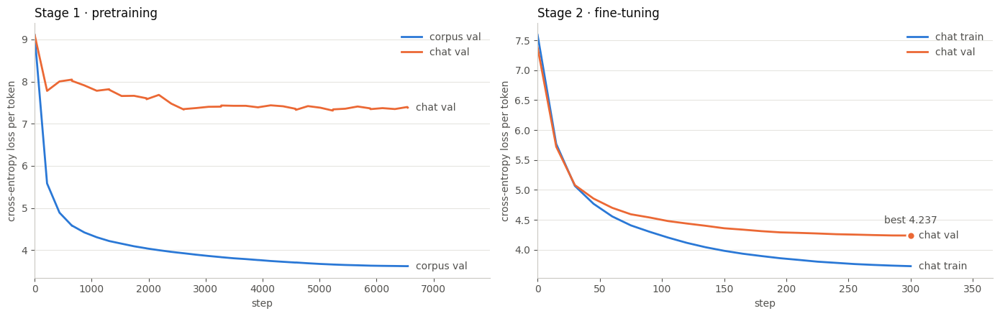

# KabyLLM

Language models for **Kabyle (Taqbaylit)**, a low-resource Berber language — a personal research project (2026).

The project explores three routes, each documented and runnable on Kaggle's free GPUs:

| Track | Where | What it does | Outcome |
|---|---|---|---|
| **v0 · GPT from scratch** | [`notebooks/v0_gpt_from_scratch_wiki.ipynb`](notebooks/v0_gpt_from_scratch_wiki.ipynb) | 43M-parameter GPT trained on ~1M tokens of Kabyle Wikipedia | memorized its data (train 1.33 / val 6.21) — the baseline to beat |
| **Chat models from scratch** | [`notebooks/chat_v1_from_scratch.ipynb`](notebooks/chat_v1_from_scratch.ipynb), [`notebooks/chat_v2_pretrain_finetune.ipynb`](notebooks/chat_v2_pretrain_finetune.ipynb) | Llama-style decoder (RMSNorm, RoPE, SwiGLU) with a byte-level BPE tokenizer; v2 pretrains a 36M model on a 120M-character Kabyle corpus, then fine-tunes on romanized chat messages | two-stage recipe, compared on the same validation set in bits per character |
| **Cross-lingual adaptation** | [`kabyl/`](kabyl), [`scripts/`](scripts), [`PLAN.md`](PLAN.md) | full data pipeline (legacy-font PDF decoding, filtering, deduplication), tokenizer benchmarking, continued pretraining and instruction tuning of a multilingual base model, GGUF export | pipeline and 40 regression tests; see *Measured results* below |

> **Data is not included.** Book extracts are copyrighted, the chat corpus is private, and the built corpora are hundreds of megabytes. The public corpora can be rebuilt with the scripts below; corpus and tokenizer statistics are kept in [`reports/`](reports).

## Chat model v2 — measured results

Run on one Kaggle T4 ([executed notebook](notebooks/chat_v2_pretrain_finetune.ipynb)):

- **Model**: 10 layers, d_model 512, 8 heads, SwiGLU, 512-token context, 8,192-token byte-level BPE — **36.3M parameters**.
- **Stage 1**: pretraining on 1.0M lines / 120M characters of Kabyle, converted to chat spelling: 6,548 steps, 107M tokens, 46 min.
- **Stage 2**: fine-tuning on the chat corpus: 300 steps, 1 min 36 s.

| Discussion validation (same 6,600 messages) | bits per character ↓ |
|---|---:|
| Run 1 · 11.4M model trained on the chat only | 2.046 |
| Run 2 · after pretraining only (never saw the chat) | 3.445 |
| **Run 2 · pretraining + fine-tuning** | **1.977** (−3.3 %) |



Model generations from the chat stage are not shown because they imitate private conversations.

## Adaptation pipeline

A Kabyle conversational assistant, built by adapting a multilingual base model rather than training from scratch.

See [PLAN.md](PLAN.md) for the reasoning behind the approach. The short version: all
the Kabyle text that exists is on the order of 40M tokens, which is three to four
orders of magnitude short of what a from-scratch model needs. Adapting a pretrained
model means the Kabyle data only has to teach the *language* — the reasoning and world
knowledge come from the base model's trillions of tokens.

---

## Pipeline

| Phase | Script | Runs on | What it produces |
|---|---|---|---|
| 1 | `01_decode_pdfs.py` | CPU | Clean text from PDFs, incl. legacy Berber fonts |
| 2 | `02_build_corpus.py` | CPU | Filtered, deduplicated corpus + splits |
| 3 | `03_tokenizer.py` | CPU/GPU | Fertility report; vocabulary-extended model |
| 4 | `04_cpt_train.py` | GPU | Kabyle-adapted base model |
| 5 | `05_build_sft.py` | CPU (+GPU) | Kabyle instruction dataset |
| 6 | `06_sft_train.py` | GPU | Instruction-following model |
| 7 | `07_eval.py` | GPU | Metrics + manual review samples |
| 8 | `08_export_gguf.py` | CPU | GGUF for laptop inference |

```bash
pip install -r requirements.txt

python scripts/01_decode_pdfs.py --in . --out data/interim --solve
python scripts/02_build_corpus.py --audit          # read the samples first
python scripts/02_build_corpus.py --out data/corpus
python scripts/03_tokenizer.py --bench --corpus data/corpus/train.jsonl
```

Phases 4 and 6 need a GPU — use [notebooks/kaggle_cpt.py](notebooks/kaggle_cpt.py).

---

## What the code knows that a generic pipeline does not

**Kabyle orthography is a mess of confusables.** Greek ε, Cyrillic ԑ, and Latin ɛ all
appear for the same letter; ram's-horn ɤ appears for ɣ. Each variant silently forks the
vocabulary. [kabyl/alphabet.py](kabyl/alphabet.py) folds them; a *whitelist* — what the
v0 notebook used — cannot, because it can only reject, never repair.

**Kabyle books are typeset in pre-Unicode fonts.** They encode ɣ as `$`, ṭ as `î`, ẓ as
`é`. It is a substitution cipher, and it is *per font* — the same book uses different
ciphers for its roman and italic faces, so `ê` means ḥ in one and ṛ in the other.
[kabyl/pdf_decode.py](kabyl/pdf_decode.py) decodes span by span using the font name.
[kabyl/cipher.py](kabyl/cipher.py) *solves* unknown fonts automatically by minimizing
out-of-vocabulary rate against a Kabyle dictionary, which is what makes the ~600
community PDFs usable without manual cryptanalysis.

**Kabyle is agglutinative.** `zedɣen-tt`, `yenna-yas`, `tessufuɣ-d` are single words
carrying subject, object, aspect and deixis. The v0 tokenizer split on `-` and lowercased
everything, giving 35k word types of which 42% appeared exactly once and a 6.5% UNK rate.
Clitics are preserved throughout this pipeline.

**Emphatic consonants are written inconsistently.** Wikipedia writes `urumi`, literary
Kabyle writes `uṛumi`. The cipher solver folds ṛ/r, ṣ/s, ṭ/t, ẓ/z during search so that
inconsistency cannot mislead it, then disambiguates afterwards against exact spellings.

---

## Hardware notes

Written for Kaggle's free tier, and the two constraints that implies:

- **T4 is Turing (SM 7.5): no bf16, no FlashAttention-2.** `kabyl.training` detects the
  capability and selects fp16 + `sdpa`. Do not override it.
- **Sessions are capped at 12 hours**, 30 h/week. `HubCheckpointer` pushes state to a
  private Hub repo and `SessionGuard` stops voluntarily at 11 hours so the final
  checkpoint is always written. The v0 run lost 8,207 steps to an interrupted session.

Estimated total: **~28 GPU-hours**, roughly one week of quota.

---

## Measured results

Tokenizer fertility on 400k characters of Kabyle (`scripts/03_tokenizer.py --bench`):

| Tokenizer | tokens/word | diacritic penalty |
|---|---|---|
| Qwen3 (1.7B / 4B) | **2.77** | 1.06× |
| SmolLM3-3B | 2.96 | 1.47× |
| Mistral-7B-v0.3 | 3.03 | 1.13× |
| *NLLB-200 (trained with Kabyle)* | *2.26* | *0.88×* |

English byte-BPE sits near 1.3, so Kabyle costs Qwen3 about **2.1× more tokens** for the
same content — a direct multiplier on training FLOPs and a halving of usable context.

Worth noting because it contradicts the original plan: the diacritic penalty is only
**1.06×**. The cost is not ɣ and ḍ being expensive, it is Kabyle *morphology* being
unfamiliar. NLLB — which actually trained on Kabyle — reaches 2.26, so vocabulary
extension should target roughly **1.9**, not the 1.6 estimated before measuring.

---

## Testing

```bash
python -m pytest tests/ -q      # 40 tests
```

Every case is a bug that actually occurred or a real string from the source corpora.

---

## The v0 baseline

[notebooks/v0_gpt_from_scratch_wiki.ipynb](notebooks/v0_gpt_from_scratch_wiki.ipynb) is kept, unmodified, as the documented starting point:
a 43.27M-parameter model trained from scratch on 995,159 tokens, reaching
`train=1.33 / val=6.21`. That gap is not an undertrained model, it is a memorized one —
Chinchilla-optimal for 1M tokens is roughly a 50K-parameter model, so it was ~800×
over-parameterized and had no other option.

It is the number to beat, and the reason the approach changed.

---

## Credit

The corpora this depends on were collected by the Kabyle NLP community, principally
[`Imsidag-community`](https://huggingface.co/Imsidag-community) and
[`boffire`](https://huggingface.co/boffire) on HuggingFace, plus
[Tatoeba](https://tatoeba.org), [Common Voice](https://commonvoice.mozilla.org), and
Kabyle Wikipedia. Publishing the merged, normalized corpus back is worth more to Kabyle
NLP than the model.

## License

Code released under the [MIT License](LICENSE). The corpora it builds on keep their own licenses.

---

## Author

**Amar Merabti** — native Kabyle speaker, M2 Data, Knowledge & Intelligence (Université Paris Cité).
